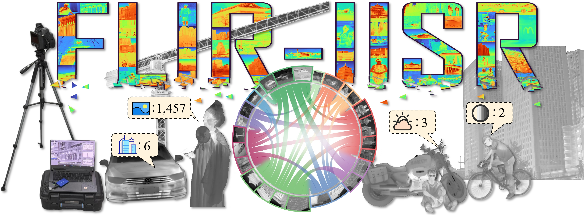

<h1 align="center">Toward Real-world Infrared Image Super-Resolution: A Unified Autoregressive Framework and Benchmark Dataset</h1>

[Yang Zou](mailto:archerv2@mail.nwpu.edu.cn), [Jun Ma](mailto:junma.work812@gmail.com), [Zhidong Jiao](mailto:jiaozhidong97@gmail.com), [Xingyuan Li](mailto:xingyuan_lxy@163.com), Zhiying Jiang, and Jinyuan Liu, "Toward Real-world Infrared Image Super-Resolution: A Unified Autoregressive Framework and Benchmark Dataset", CVPR 2026

## :rocket: Updates 
[2026-3-4] Our dataset is now available.🔥🔥🔥 

[2026-2-21] Our paper has been accepted by CVPR 2026. The code and dataset have been officially released.🎉🎉🎉

<h2> 
📦 FLIR-IISR Dataset 📦
 </h2>

## :open_book: Dataset Details 

### Download

### Composition ($1457$ pairs)

- **Degradation labels**:
  - **Optical blur ($1305$)**;  **Motion blur ($152$)**.
- **Semantic labels ($12$ categories)**:
  -  person ($309$), bicycle ($22$), motorcycle ($27$), tricycle ($13$), car ($234$), bus ($5$) plane ($54$), statue ($157$), regular object ($248$), building ($706$), road ($132$), and complex scene ($401$).

- **Total number of image pairs**: $1457$

- **Image size**: $1024 \times 768$

### 🖼️ Preview

---

 
---

## 📫 Contact
If you have any questions, feel free to contact us through <code style="background-color: #f0f0f0;">archerv2@mail.nwpu.edu.cn</code>。
