<h1 align="center">Toward Real-world Infrared Image Super-Resolution: A Unified Autoregressive Framework and Benchmark Dataset</h1>

[Yang Zou](mailto:archerv2@mail.nwpu.edu.cn), [Jun Ma](mailto:junma.work812@gmail.com), [Zhidong Jiao](mailto:jiaozhidong97@gmail.com), [Xingyuan Li](mailto:xingyuan_lxy@163.com), Zhiying Jiang, and Jinyuan Liu, "Toward Real-world Infrared Image Super-Resolution: A Unified Autoregressive Framework and Benchmark Dataset", CVPR 2026

<div>
<a href="https://arxiv.org/abs/2603.04745"></a>
<a href="https://github.com/JZD151/Real-IISR" target='_blank' style="text-decoration: none;"></a>
<a href="https://github.com/JZD151/Real-IISR/stargazers" target='_blank' style="text-decoration: none;"></a>
</div>

## :rocket: Updates 
[2026-3-10] Our training code and inference code is now available.📦📦📦

[2026-3-6] You can find our paper [here](https://arxiv.org/abs/2603.04745). ⭐️⭐️⭐️

[2026-3-4] Our dataset is now available.🔥🔥🔥 

[2026-2-21] Our paper has been accepted by CVPR 2026. The code and dataset have been officially released.🎉🎉🎉

<h2> <p align="center">📁 FLIR-IISR Dataset 📁</p> </h2>

## :open_book: Dataset Details 

### Download

[](https://drive.google.com/file/d/160kKxHLxzZWXKILFLncoWRhB33SriWCP/view?usp=sharing)
[](https://huggingface.co/datasets/yuanzsz/FLIR-IISR/tree/main)
[](https://pan.baidu.com/s/1oysR3x-BCCLrd992Wq6Upw?pwd=FLIR)

### Composition ($1457$ pairs)

- **Scene labels ($12$ categories)**:
  -  person ($309$), bicycle ($22$), motorcycle ($27$), tricycle ($13$), car ($234$), bus ($5$) plane ($54$), statue ($157$), regular object ($248$), building ($706$), road ($132$), and complex scene ($401$).
- **Degradation labels**:
  - Optical blur ($1305$);  Motion blur ($152$).

- **Total number of image pairs**: $1457$

- **Image size**: $1024 \times 768$

### Preview

---
Scene labels:
<table align="center">
<tr>
<td align="center">
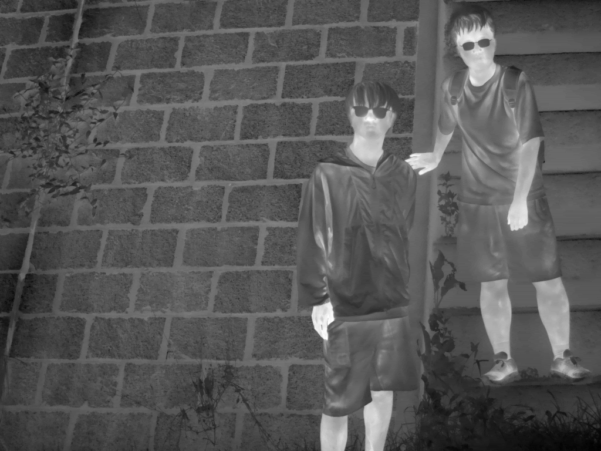<br>
person (309)
</td>
<td align="center">
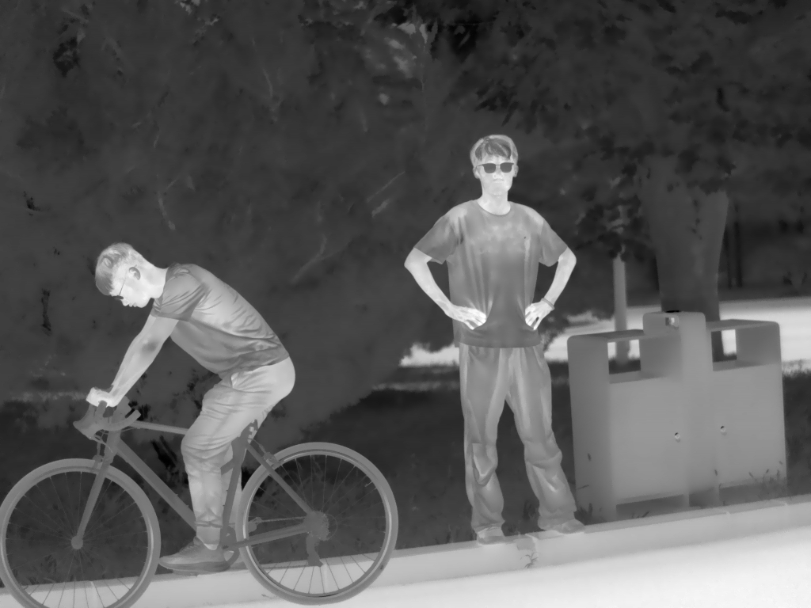<br>
bicycle (22)
</td>
<td align="center">
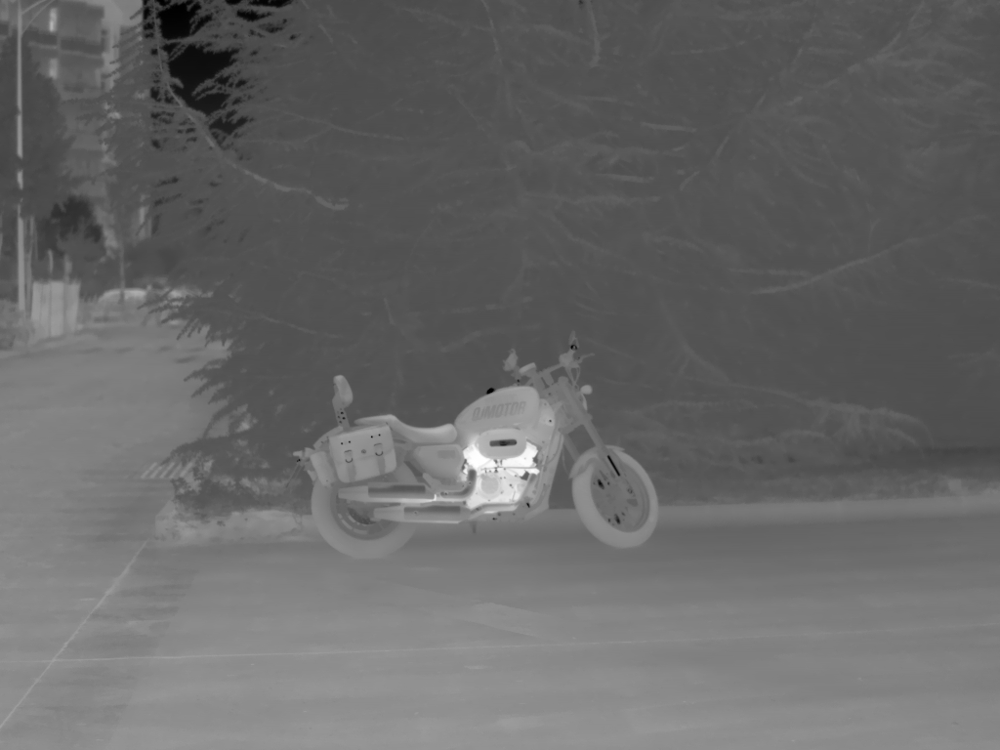<br>
motorcycle (27)
</td>
<td align="center">
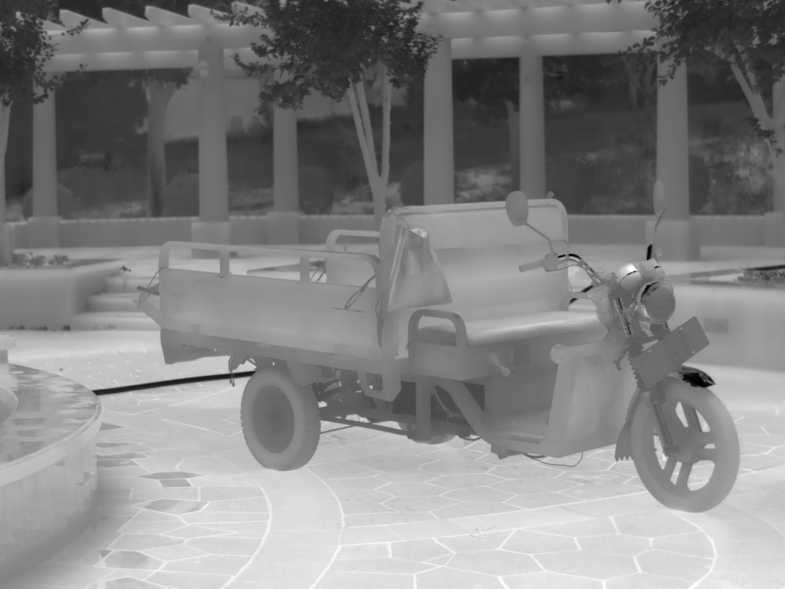<br>
tricycle (13)
</td>
</tr>

<tr>
<td align="center">
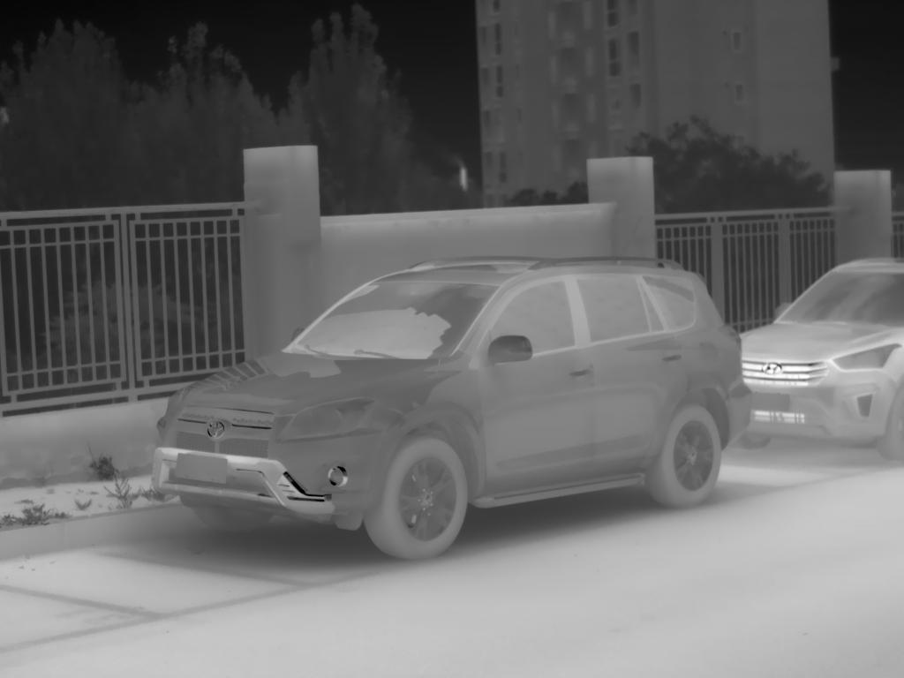<br>
car (234)
</td>
<td align="center">
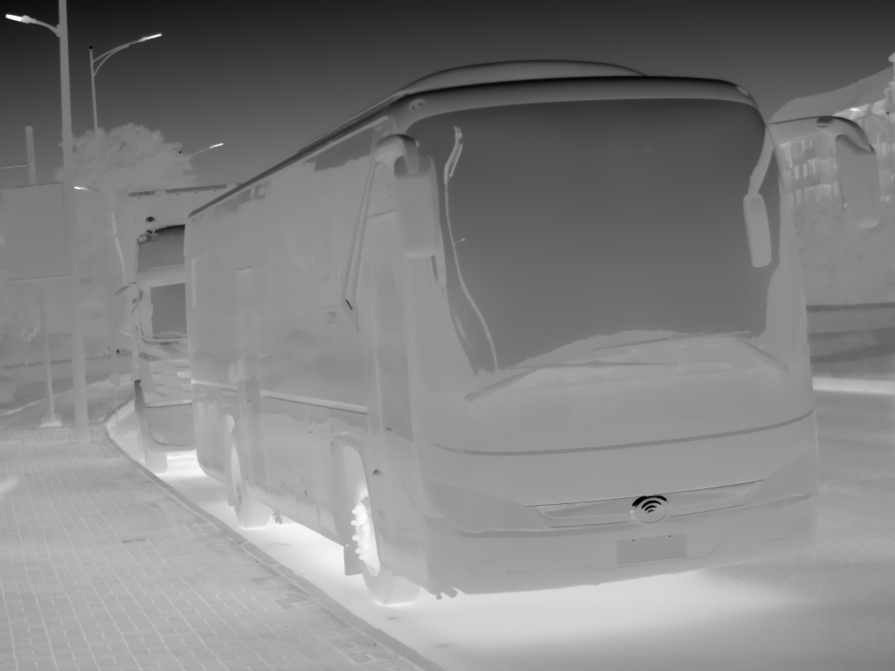<br>
bus (5)
</td>
<td align="center">
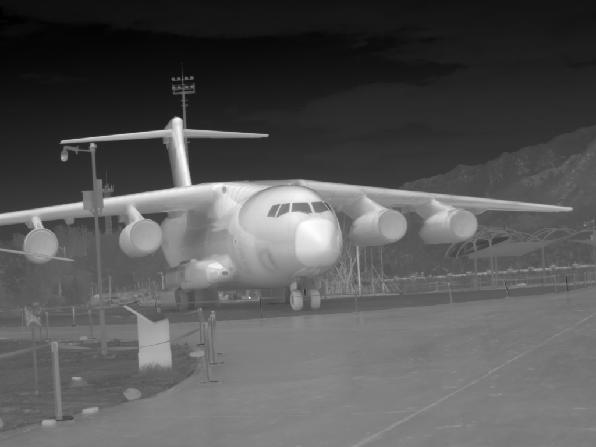<br>
plane (54)
</td>
<td align="center">
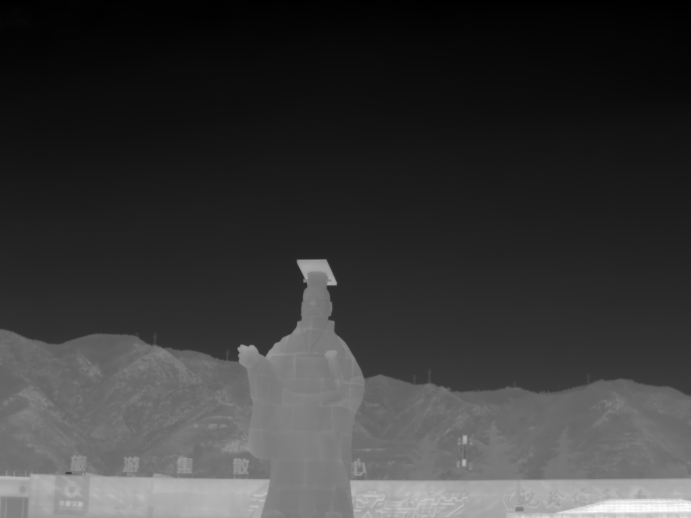<br>
statue (157)
</td>
</tr>

<tr>
<td align="center">
<br>
regular object (248)
</td>
<td align="center">
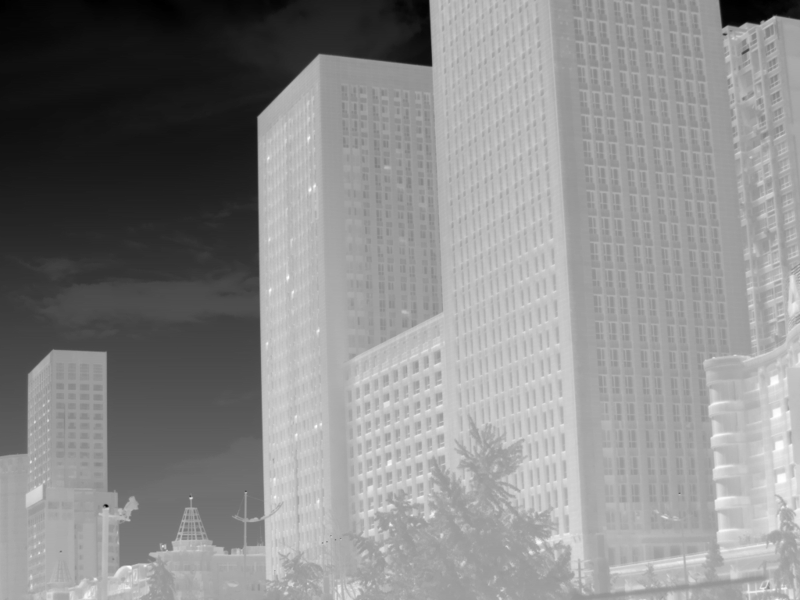<br>
building (706)
</td>
<td align="center">
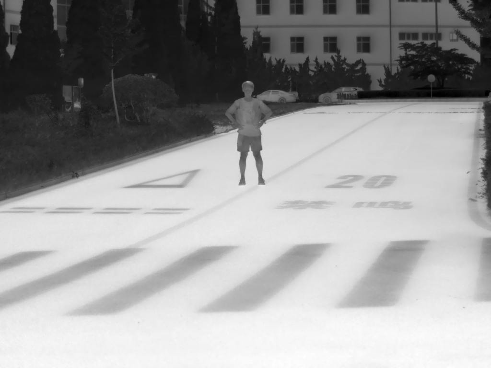<br>
road (132)
</td>
<td align="center">
<br>
complex scene (401)
</td>
</tr>
</table>

Degradation labels:
<table align="center">
<tr>
<td align="center">
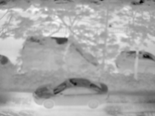<br>
Optical blur (1305)
</td>
<td align="center">
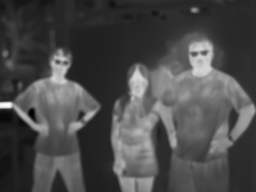<br>
Optical blur (1305)
</td>
<td align="center">
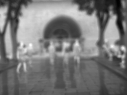<br>
Motion blur (152)
</td>
<td align="center">
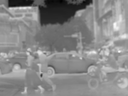<br>
Motion blur (152)
</td>
</tr>
</table>

---

<h2> <p align="center">📦 Real-IISR 📦</p> </h2>

## ⚙️ Dependencies

```
git clone https://github.com/JZD151/Real-IISR.git
cd Real-IISR

conda create -n Real-IISR python=3.10
conda activate Real-IISR
pip install -r requirements.txt
pip install flash_attn-2.7.4.post1 --no-build-isolation
```

## 🔧 Training

1. Download the pretrained VQVAE and VARSR models from [](https://huggingface.co/qyp2000/VARSR/resolve/main/VQVAE.pth?download=true) and [](https://huggingface.co/qyp2000/VARSR/resolve/main/VARSR.pth?download=true), and place them in the ./checkpoints directory.
2. Download the FLIR-IISR dataset and extract it.

```
python train.py --batch_size 4 --ep 20 --fp16 1 --tblr 5e-5 --alng 1e-4 --wpe 0.01 --fuse 0 --exp_name Real-IISR
```

## 🔨 Testing
> **Note:** We provide several sample inputs for easy inference.
1. Download the pretrained model from [](https://drive.google.com/file/d/1QIPIXx4Sr5DxYFzu1D8x1T4-AwDeMRL8/view?usp=sharing) , and place it in the ./checkpoints directory.

```
python test.py
```

## 📫 Contact

If you have any questions, feel free to contact us through <code style="background-color: #f0f0f0;">archerv2@mail.nwpu.edu.cn</code>.

## 📎 Citation
```
@article{zou2026toward,
  title={Toward Real-world Infrared Image Super-Resolution: A Unified Autoregressive Framework and Benchmark Dataset},
  author={Zou, Yang and Ma, Jun and Jiao, Zhidong and Li, Xingyuan and Jiang, Zhiying and Liu, Jinyuan},
  journal={arXiv preprint arXiv:2603.04745},
  year={2026}
}
```

## 💡 Acknowledgements

Our codes are based on [VAR](https://github.com/FoundationVision/VAR), [VARSR](https://github.com/quyp2000/VARSR), thanks for their contribution.
